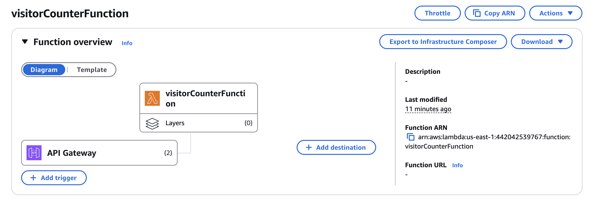
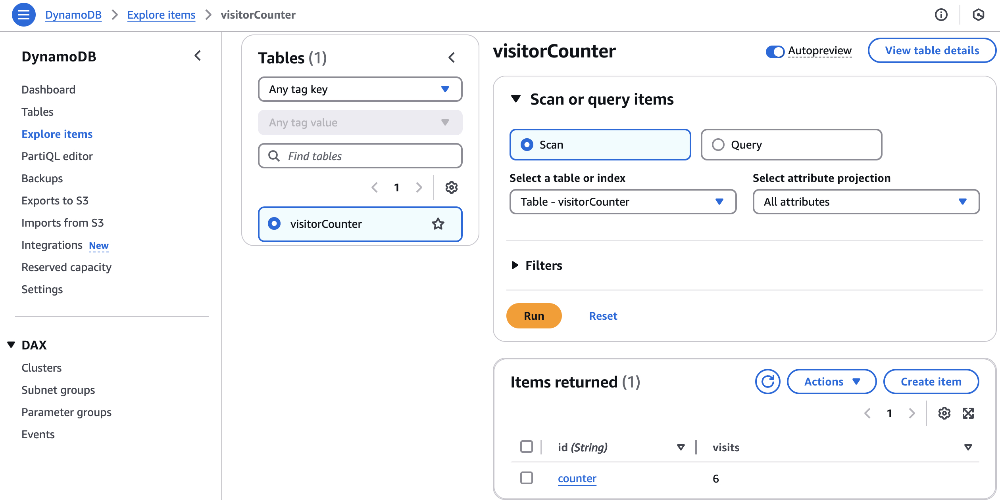
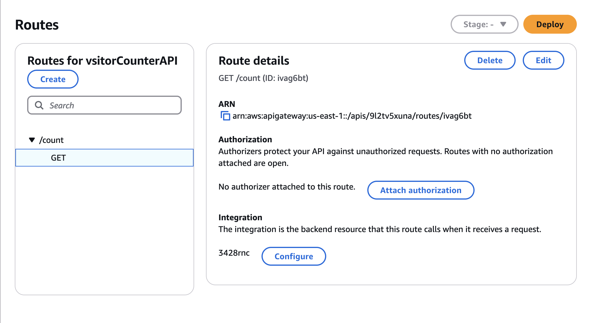
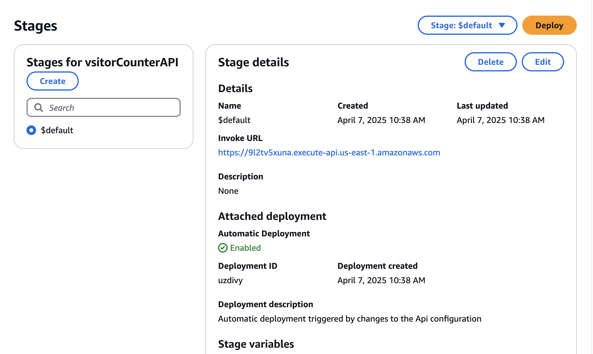

# Cloud Resume Challenge – Backend

This is the backend infrastructure and logic for the [Cloud Resume Challenge](https://cloudresumechallenge.dev/). It handles a visitor counter using AWS services like Lambda, API Gateway, and DynamoDB — all defined and deployed using Terraform.

## 🚀 Tech Stack

- **AWS Lambda** – Python-based backend function
- **API Gateway (HTTP)** – Front-door for the Lambda function
- **DynamoDB** – NoSQL DB to store the visitor count
- **Terraform** – Infrastructure as Code
- **GitHub Actions** – CI/CD pipeline for automatic deployment
- **Pytest** – Python unit testing for Lambda

## 🗂️ Project Structure

```
backend-terraform/
├── api-gateway.tf         # Defines API Gateway
├── dynamodb.tf            # Defines DynamoDB table
├── iam-role.tf            # IAM role + policy for Lambda access
├── lambda.tf              # Lambda function setup
├── providers.tf           # Terraform provider setup
├── variables.tf           # Input variables
├── outputs.tf             # Terraform outputs
├── lambda_function.py     # Lambda function code
├── test/
│   └── test_lambda.py     # Pytest unit test
└── .gitignore             # Files to ignore in git
└── requirements.txt       # All Dependencies
└── terrafrom-import.sh    # imports all existing resources
└── images/                # screenshots
└── README.md              # Explanation

```
---

## 🔁 CI/CD – GitHub Actions

A GitHub Actions workflow automates the Terraform deployment:

- Triggered when `.tf`, `lambda_function.py`, or the workflow itself changes.
- Automatically zips and deploys the Lambda function.
- Runs `terraform-import.sh` to import existing resources (DynamoDB, API Gateway, Lambda) if needed.
- Adds permission for API Gateway to invoke Lambda.
- Applies changes using `terraform apply`.

No duplicated resources—fully idempotent and production-safe!

---

## 🧪 Testing

To run unit tests for the Lambda function:

```bash
# Activate your virtual environment if needed
source venv/bin/activate

# Run pytest
pytest tests/
```
## ⚙️ Deployment (Terraform)

Initialize and deploy the infrastructure:

```bash
terraform init
terraform plan
terraform apply
```

## 🚀 How it Works

1. Frontend makes a **GET** request to `/visitor-count`.
2. API Gateway forwards the request to Lambda.
3. Lambda fetches the count from DynamoDB, increments, and updates it.
4. The new count is returned and shown on the frontend.


### 1. Lambda Function 
Lambda function that reads, updates, and returns the visitor count from DynamoDB.



---

### 2. DynamoDB Table
A DynamoDB table named `visitor-counter` with an item key `id = visitor_count`.



---

### 3. API Gateway Route
A REST API route `/visitor-count` configured to trigger the Lambda function.



---

### 4. API Gateway Invoke URL
Base URL to trigger the Lambda function via HTTP request.



---

Once deployed, we'll get:
- An API Gateway Invoke URL
- A DynamoDB table named `visitorCounter`
- A Lambda function that updates and returns the visitor count

💡 Notes
The backend resources were deleted and re-imported cleanly using terraform-import.sh.

Terraform state is kept clean with no duplicated resources.

GitHub Actions ensures updates happen only on changes to .tf files or lambda_function.py.


